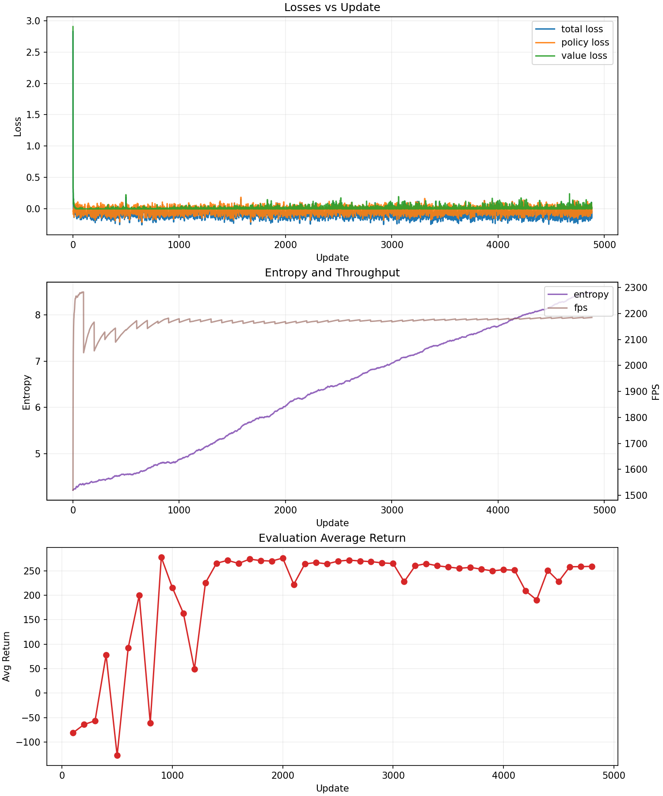

**Overview**
- This repo trains a PPO agent for `BipedalWalker-v3` using a compact CLI in `walker.py` and the core logic in `walker_core.py`.
- Only these two files are used. Other files in the repo are not required.

**Quick Start**
- Requirements: Python 3.9+, `torch`, `gymnasium`, `gymnasium[box2d]`, `numpy`, `imageio`.
- Run training: `python walker.py`
- Checkpoints write to `checkpoints_walker/`. Final evaluation video writes to `videos/`.

**Results Preview**
- Training curves (render directly on GitHub):
  - 

- Final evaluation video (MP4; click thumbnail to play on GitHub):
  - 

**Files**
- `walker.py`: Thin entrypoint that calls `walker_core.train()`.
- `walker_core.py`: PPO implementation, environment wrappers, evaluation, checkpointing, and final video export.
  - Also logs metrics to CSV and calls the plotting helper in `viz.py` at the end of training.

**Training Tricks (What Makes It Work)**
- Vectorized envs: Uses `SyncVectorEnv` with `NUM_ENVS=8` to improve sample throughput while keeping debugging simple.
- Observation and reward normalization: Wraps envs with `NormalizeObservation` and `NormalizeReward` and clips to `[-10, 10]` to stabilize learning and bound outliers.
- Action distribution: Gaussian policy with a learnable `log_std` passed through softplus to ensure strictly positive standard deviations and smoother exploration.
- Actor/critic architecture: Actor uses a 16-unit bottleneck head for stable means; critic is wider (512→512→256) to improve value estimation.
- GAE and PPO clipping: Computes Generalized Advantage Estimation and uses PPO’s clipped objective (`CLIP_EPS=0.2`) to limit destructive policy updates.
- Entropy and value losses: Adds entropy bonus (`ENTROPY_COEF`) to encourage exploration and value loss (`VALUE_COEF`) for accurate baselines.
- Grad clipping: Clips global norm (`0.5`) to avoid exploding gradients.
- Deterministic evaluation: Uses the policy mean action during eval/video for a smoother, more stable gait.
- Consistent normalization at eval: Pulls training-time observation RMS stats from the vector envs and reapplies them during evaluation and video recording.
- Preallocated on-device buffers: Preallocates rollout tensors on the selected device to reduce allocation overhead.
- Sane seeding: Seeds Python, NumPy, Torch, and envs for reproducibility; sets CUDA matmul precision to `"medium"` when available for speed.

**How It Runs**
- `python walker.py` → `walker_core.train()`
- Train loop collects `ROLLOUT_STEPS × NUM_ENVS` transitions, computes advantages/returns, runs PPO epochs/minibatches, logs progress, periodically evaluates/saves.
- After training, it renders a short deterministic rollout and writes a single MP4.

**Notes**
- `CAPTURE_VIDEO` during training is disabled for speed; only a final video is produced.
- Ensure Box2D is available (`pip install "gymnasium[box2d]"`). GPU is optional; code auto-selects CUDA if present.
