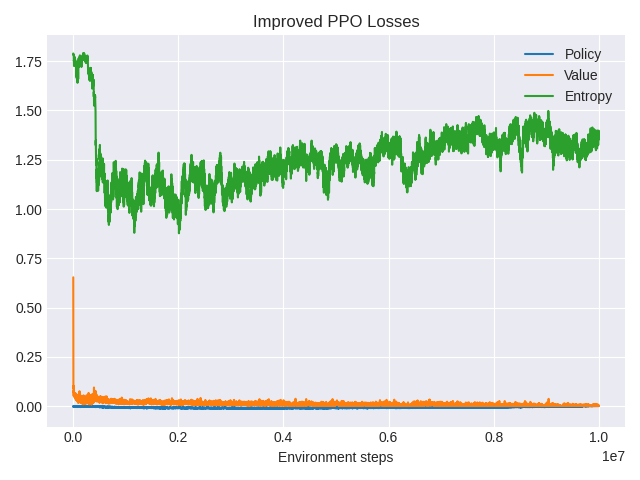
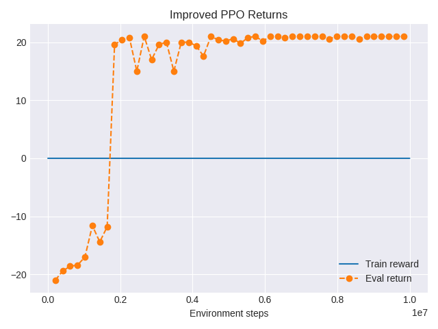

# Improved PPO for Atari Pong

This directory contains a single, high-performance **Proximal Policy Optimization (PPO)** implementation for Atari Pong, driven entirely by `improved-atari-pong.py`.

## 🎮 Overview

The `improved-atari-pong.py` script implements vectorized PPO training on `PongNoFrameskip-v4` with robust preprocessing, frame stacking, environment wrappers, and a carefully tuned training loop. A dataclass-backed `Config` centralizes hyperparameters, logging toggles, and filesystem paths so runs are fully reproducible and easy to tweak.

The latest run (see `images/ppo_improved/improved_pong_eval_PongNoFrameskip-v4__PPO-Improved-Pong__11__1763303793.mp4`) uses this script as the entry point, builds a `SyncVectorEnv` of wrapped Pong instances, normalizes observations via `prepare_obs`, and feeds them into an `ActorCritic` network that can optionally apply data augmentation. Rollouts are stored in a purpose-built `RolloutBuffer`, and PPO updates support PyTorch AMP autocast/scaling for efficient GPU training. Evaluation reuses the same network in deterministic mode and automatically records MP4s and Matplotlib plots into `images/ppo_improved/` and `plots/ppo_improved/`.

## Techniques That Made It Work

- **Random-shift augmentation on-policy** – The `RandomShiftsAug` module applies DrQ-style spatial jitters directly to stacked grayscale Pong frames but is disabled for evaluation, improving generalization without complicating the data pipeline.
- **Channel/order guardrails** – `prepare_obs` inspects tensor ranks coming out of `SyncVectorEnv` (which reorders axes compared to the single-env API) and converts them to contiguous, channel-first float tensors on the fly, removing a common class of silent observation bugs.
- **Return accounting for vector envs** – The rollout loop reads both `final_observation` and `final_info` so truncated Pong episodes still contribute rewards to training statistics, making the moving-average training curve trustworthy.
- **Stability guards during optimization** – Learning-rate annealing and an optional KL early-stop keep policy updates gentle, while AMP and gradient scaling provide extra throughput on GPUs without blowing up the critic.

## Latest Training Plots





### 🏓 Trained Agent in Action


*Improved PPO agent playing Pong after extended training, consistently beating the built-in opponent.*

## 📁 Key File

- `improved-atari-pong.py` – Main entry point implementing the improved PPO pipeline for Pong, including environment setup, model definition, training loop, evaluation, logging, and artifact saving.

## 🚀 Core Features

- **Vectorized Training**: Multiple parallel Pong environments for efficient data collection.
- **Generalized Advantage Estimation (GAE)**: λ = 0.95 for a solid bias–variance tradeoff.
- **Clipped Surrogate Objective**: Prevents destructive policy updates.
- **Value Function Clipping**: Stabilizes critic training.
- **Gradient Clipping**: Prevents exploding gradients (e.g., `max_grad_norm = 0.5`).
- **Config-Driven Runs**: A single `Config` dataclass controls seeds, paths, and all hyperparameters.

## ⚙️ Typical Hyperparameters

| Parameter | Value | Description |
|-----------|-------|-------------|
| Learning Rate | 2.5e-4 | Adam optimizer learning rate |
| Discount Factor | 0.99 | Reward discount factor |
| Parallel Envs | 8 | Number of vectorized Pong environments |
| Steps per Rollout | 128 | Steps collected per environment |
| Minibatches | 4 | Number of minibatches per update |
| PPO Epochs | 4 | Training epochs per rollout |
| Clip Range | 0.1 | PPO clipping parameter |
| Entropy Coeff | 0.01 | Entropy bonus coefficient |
| Value Coeff | 0.5 | Value loss coefficient |
| GAE Lambda | 0.95 | Advantage estimation parameter |

## 🏃‍♂️ Quick Start

### Prerequisites

```bash
pip install torch gymnasium ale-py wandb opencv-python imageio
```

### Train the Improved Pong Agent

```bash
python improved-atari-pong.py
```

The script will automatically:
- Initialize vectorized Pong environments with standard Atari preprocessing.
- Train an `ActorCritic` agent with PPO.
- Periodically evaluate the policy and save MP4s to `images/ppo_improved/`.
- Save training curves (losses, returns) as PNGs under `plots/ppo_improved/`.

## 🔧 Technical Details

### Environment and Observations

1. **Base Env**: `PongNoFrameskip-v4` from the ALE backend.
2. **Preprocessing**: RGB frames → grayscale and resized.
3. **Frame Stacking**: 4 consecutive frames as input to the network.
4. **Reward Clipping**: Rewards clipped to a narrow range for stability.
5. **Vectorization**: `SyncVectorEnv` wraps multiple Pong instances for faster training.

### Training Loop

1. **Rollout Collection**: Collect trajectories from all vectorized Pong environments.
2. **Advantage Estimation**: Compute GAE advantages using the current value function.
3. **Policy Update**: Perform PPO epochs with minibatch updates and clipping.
4. **Value Update**: Train the critic with a clipped value loss and gradient clipping.
5. **Evaluation**: Run deterministic episodes, record MP4s, and log aggregated returns.

## 🎯 Practical Tips

1. **Give It Time**: Let training run for tens of millions of frames for a strong Pong agent.
2. **Watch the Curves**: Monitor the loss and return plots under `plots/ppo_improved/` for instability.
3. **Tune Carefully**: Small changes to learning rate or clip range can noticeably affect performance.
4. **Use Deterministic Seeds**: Keep seeds fixed in the `Config` to reproduce good runs.

## 📚 References

- [Proximal Policy Optimization](https://arxiv.org/abs/1707.06347)
- [Human-level control through deep reinforcement learning](https://www.nature.com/articles/nature14236)
- [Generalized Advantage Estimation](https://arxiv.org/abs/1506.02438)
