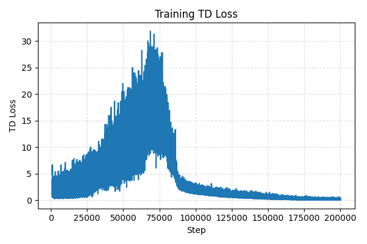

# Reinforcement Learning Portfolio

- **Pong-PPO** – Improved PPO with vectorized Atari preprocessing, GAE, and augmentation.  
  

- **BipedalWalker** – PPO agent with normalized vector envs and deterministic evaluation.  
  

- **Lunar-Landar** – Simple policy-gradient style training for LunarLander; latest clip (epoch 526).  
  https://github.com/user-attachments/assets/8f2ec8d4-4c19-4745-9ca7-b4ff2acb1ca5

- **VizDoom-RL** – DQN/Double DQN with dueling heads and soft target updates.  
  
