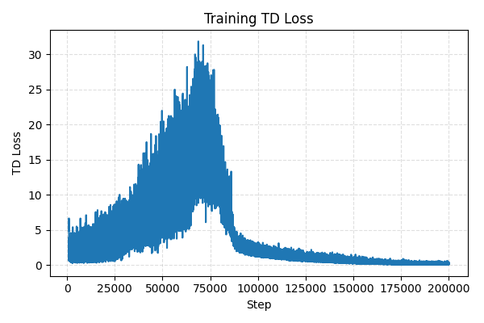
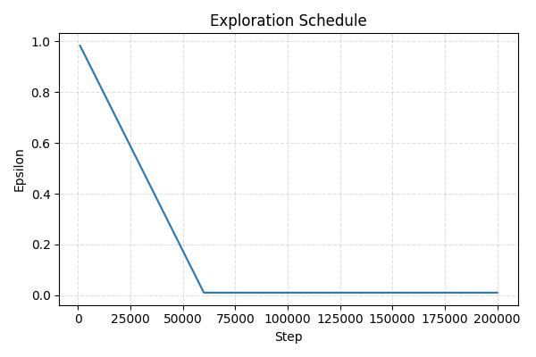
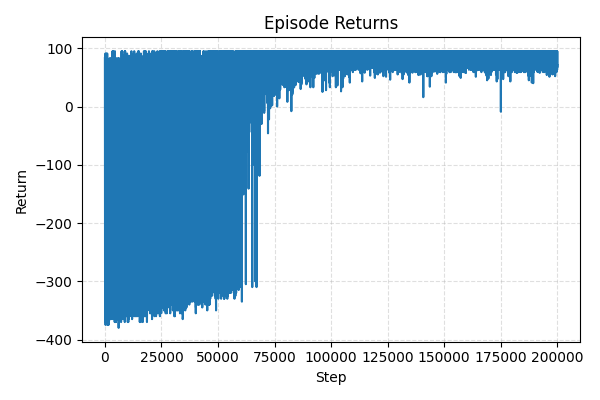
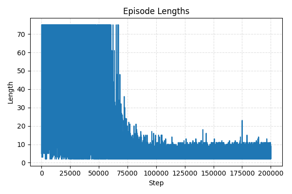
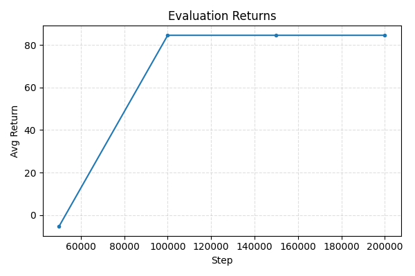

# train_vizDoom DQN

A compact, fast DQN training script for VizDoom using Gymnasium. It trains an agent on the Basic scenario with optional Double DQN and Dueling heads, produces plots, saves checkpoints, and can capture evaluation videos.

**Script**: `train_vizdoom.py`

## How It Works
- Environment: `VizdoomBasic-v0` via the Gymnasium VizDoom wrapper with `frame_skip=4` and optional RGB capture for videos.
- Observations: grayscale, resized to `84x84`, with configurable `--frame-stack` for temporal context.
- Network: convolutional trunk feeding an MLP head; optional Dueling head to split Value and Advantage.
- Training: standard DQN with a replay buffer (from SB3), epsilon-greedy linear schedule, and a target network updated every `--target-network-frequency` steps with soft blending `--tau`.
- Targets: optional Double DQN (online selects, target evaluates) to reduce overestimation.
- Loss/optim: MSE or Huber TD loss, Adam, and optional gradient norm clipping (`--grad-clip`).
- Eval + logging: periodic eval episodes, optional video capture, and automatic charts for loss/epsilon/returns/lengths.
- Checkpointing: periodic full-state checkpoints with `--checkpoint-every` and auto-resume (`--resume` or `--resume-from`).

## Techniques Used 
- Double DQN targets (`--double-dqn`) to decouple action selection from evaluation.
- Dueling head (`--dueling`) to stabilize value estimation when many actions are similar.
- Soft target update: `target = tau * online + (1 - tau) * target` at `--target-network-frequency` steps.
- Huber loss (`--loss huber`) for robustness to outliers in TD errors.
- Gradient clipping (`--grad-clip`) to tame occasional large updates.
- Optional `torch.compile` to speed up on supported PyTorch versions (`--compile`).

## Quick Start
- Install deps (PyTorch, VizDoom, Gymnasium, SB3 utilities, plotting):
  - `pip install torch vizdoom gymnasium stable-baselines3 matplotlib imageio opencv-python tqdm`
- Example run (your 200k DDQN finetune):
  - `python3 train_vizdoom.py --total-timesteps 200000 --double-dqn --loss huber --grad-clip 10 --end-e 0.01 --exploration-fraction 0.3 --target-network-frequency 1000 --train-frequency 1 --buffer-size 100000 --batch-size 256 --eval-episodes 10 --no-capture-video --run-name finetune-200k-ddqn`

Outputs:
- Model: `runs/<run-name>.pth` (e.g., `runs/finetune-200k-ddqn.pth`).
- Plots: `plots/<run-name>/*.png`.
- Videos: `videos/<run-name>/{train,eval}/*.mp4` when capture is enabled.
- Checkpoints: `checkpoints/<run-name>/ckpt_*.pt` when `--checkpoint-every > 0`.

## Results Snapshot (finetune-200k-ddqn)
- Final avg return: ~84.6
- Wall time: ~85 minutes on the reported run

### Training/Eval Plots

  
  

  
  

  

## Notes
- Default env, shapes, and schedules can be adjusted via CLI flags. See `train_vizdoom.py` for all options.
- To resume: `--resume` (latest for the run) or `--resume-from checkpoints/<run-name>/ckpt_XXXX.pt`.
